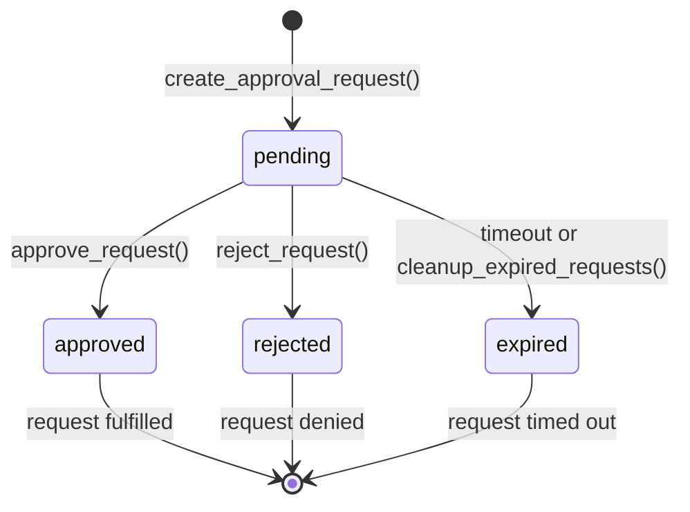

# Approval Workflows and Schema Validation

## Overview

Stage 4 introduces comprehensive approval workflows and schema validation to provide human oversight for sensitive operations while maintaining data integrity throughout the system.

## Architecture

### Core Components

1. **Schema Validation** (`src/core/schema.py`): Core data models with type safety
2. **Approval Engine** (`src/core/approval.py`): Workflow management for approvals
3. **Validation Layer** (`src/api/schemas.py`): API request/response validation
4. **Integration Points** (`src/core/corrections.py`, `src/core/dao.py`): Feature integration

### Feature Flags

```bash
# Approval system controls
APPROVAL_ENABLED=false            # Master switch for approval workflows
APPROVAL_MODE=manual              # manual|auto (manual requires human decision)
APPROVAL_TIMEOUT_SEC=3600         # Request timeout (1 hour default)
SCHEMA_VALIDATION_STRICT=false    # Strict validation mode (affects API inputs)
```

## Approval Workflow State Diagram



## Approval Request States

| State | Description | Transition |
|-------|-------------|------------|
| `pending` | Request created, awaiting decision | Auto-create on approval-needed operations |
| `approved` | Human/system approved the request | Manual approval or auto-approval when disabled |
| `rejected` | Human/system rejected the request | Manual rejection |
| `expired` | Request timed out without decision | Automatic after APPROVAL_TIMEOUT_SEC |

## API Endpoints

### Create Approval Request
```http
POST /approval/request
Content-Type: application/json

{
  "type": "correction",
  "payload": {
    "plan_id": "uuid",
    "action_type": "ADD_VECTOR",
    "key": "target_key",
    "action_metadata": {...}
  },
  "requester": "correction_system"
}
```

### Get Approval Status
```http
GET /approval/{request_id}
```

Response:
```json
{
  "id": "uuid",
  "type": "correction",
  "payload": {...},
  "requester": "correction_system",
  "status": "pending",
  "created_at": "2023-01-01T12:00:00",
  "expires_at": "2023-01-01T13:00:00"
}
```

### Approve Request
```http
POST /approval/{request_id}/approve
Content-Type: application/json

{
  "approver": "admin_user",
  "reason": "Approved for testing"
}
```

### Reject Request
```http
POST /approval/{request_id}/reject
Content-Type: application/json

{
  "approver": "admin_user",
  "reason": "Rejected due to risk"
}
```

### List Pending Requests
```http
GET /approval/pending
```

Response: Array of approval status objects

## Integration Points

### Corrections Engine Integration

When `APPROVAL_ENABLED=true` and corrections mode is `apply`, the system:

1. **Creates Approval Request** before executing any vector correction
2. **Blocks Execution** until approval is granted
3. **Logs Decisions** in episodic events for audit trail
4. **Times Out** after `APPROVAL_TIMEOUT_SEC` (default 1 hour)

```python
# In apply_corrections() -> _execute_correction_action()
if mode == "apply" and APPROVAL_ENABLED:
    approval_req = create_approval_request("correction", payload, "correction_system")
    status = wait_for_approval(approval_req.id)
    if status != "approved":
        return False, f"Correction not approved (status: {status})"
```

### Schema Validation Integration

When `SCHEMA_VALIDATION_STRICT=true`:

- **API endpoints** validate all inputs using Pydantic models
- **Invalid requests** return HTTP 422 with detailed error messages
- **Type safety** enforced throughout the request processing pipeline

When `SCHEMA_VALIDATION_STRICT=false` (default):
- **Backward compatibility** with Stage 1/2/3 behavior
- **No breaking changes** to existing API usage patterns

## Manual Approval Procedures

### 1. Monitor Pending Approvals
```bash
# List pending approval requests
curl http://localhost:8000/approval/pending
```

### 2. Review Request Details
```bash
# Get full request information
curl http://localhost:8000/approval/{request_id}
```

### 3. Make Approval Decision
```bash
# Approve request
curl -X POST http://localhost:8000/approval/{request_id}/approve \
  -H "Content-Type: application/json" \
  -d '{"approver": "admin", "reason": "Approved after review"}'

# Or reject request
curl -X POST http://localhost:8000/approval/{request_id}/reject \
  -H "Content-Type: application/json" \
  -d '{"approver": "admin", "reason": "Rejected due to policy violation"}'
```

## Configuration Guide

### Enable Strict Validation Only
```bash
export SCHEMA_VALIDATION_STRICT=true
export APPROVAL_ENABLED=false
# API validates inputs but corrections don't require approval
```

### Enable Approval Workflows
```bash
export APPROVAL_ENABLED=true
export APPROVAL_MODE=manual
export SCHEMA_VALIDATION_STRICT=true
export APPROVAL_TIMEOUT_SEC=3600
# Full approval workflow with 1-hour timeout
```

### Full Backward Compatibility
```bash
export APPROVAL_ENABLED=false
export SCHEMA_VALIDATION_STRICT=false
# Identical to Stage 1/2/3 behavior
```

## Security Considerations

### Data Protection
- **Approval requests** include payload details for operator review
- **Sensitive data** should not be included in approval payloads
- **Audit logs** are comprehensive but filtered for privacy
- **Access control** to approval endpoints should be restricted

### Approval Security
- **Requester identification** tracked in all approval requests
- **Manual decisions** logged with approver identity and reasoning
- **Timeout mechanism** prevents stale approvals
- **State immutability** once approved/rejected/expired

### Audit Trail Integrity
- **Episodic events** logged for all approval lifecycle events
- **Tamper-evident logging** through cryptographic verification
- **Compliance reporting** available through audit endpoints
- **Privacy controls** prevent sensitive data leakage in logs

## Best Practices

### For Operators
1. **Review payload details** before approving correction requests
2. **Set appropriate timeouts** based on operational needs
3. **Monitor expired requests** regularly for cleanup
4. **Use descriptive reasons** when making approval decisions

### For Developers
1. **Test with both flags enabled/disabled** to ensure compatibility
2. **Handle approval failures gracefully** in application logic
3. **Log sufficient context** in approval request payloads
4. **Use typed schemas** for all new API endpoints

### For Security Teams
1. **Implement access controls** on approval endpoints
2. **Audit approval logs** regularly for compliance
3. **Monitor approval timeout metrics** for operational issues
4. **Review approval reasons** for process improvement

## Troubleshooting

### Common Issues

**Approvals Not Working:**
- Check `APPROVAL_ENABLED=true` in environment
- Verify API endpoints return valid responses
- Check database connectivity for episodic logging

**Schema Validation Too Strict:**
- Set `SCHEMA_VALIDATION_STRICT=false` for backward compatibility
- Update client code to match expected schemas
- Use API documentation to verify request formats

**Corrections Blocked:**
- Ensure approval workflow completes successfully
- Check for expired approval requests
- Verify correction mode is set to 'apply'

### Debug Commands

```bash
# Check system health and approval status
curl http://localhost:8000/health

# List all pending approvals
curl http://localhost:8000/approval/pending

# Get detailed approval request info
curl http://localhost:8000/approval/{request_id}

# Force approve all pending (for testing only)
# Note: This is not available in production for security
```

## Future Extensions

### Automated Approval (APPROVAL_MODE=auto)
- Machine learning-based approval recommendations
- Policy-based auto-approval for low-risk operations
- Confidence scoring for automated decisions

### Advanced Workflows
- Multi-step approval chains
- Role-based approval routing
- Escalation policies for urgent requests

### Enhanced Monitoring
- Real-time approval dashboards
- Approval latency metrics
- Automated alerts for stuck workflows

### Integration Capabilities
- External approval service adapters
- Webhook notifications for approval events
- Third-party audit log exports

## Summary

Stage 4 approval workflows provide essential oversight for sensitive operations while maintaining full backward compatibility. The feature-flagged approach ensures no breaking changes while enabling comprehensive validation and human-in-the-loop decision making for automated corrections.
